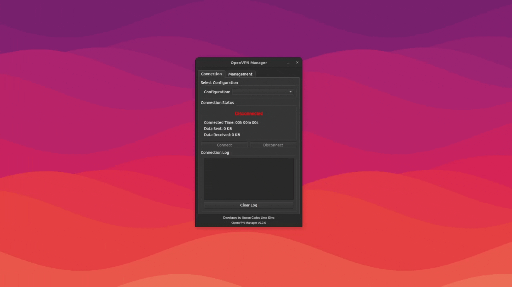

# OpenVPN Manager

A professional PyQt6-based OpenVPN connection manager for Linux systems with advanced diagnostics and seamless connectivity management.

[](https://opensource.org/licenses/MIT)
[](https://www.python.org/downloads/)
[](https://www.riverbankcomputing.com/software/pyqt/)
[](https://github.com/iagsoncarlos/openvpn-manager)

## Overview

OpenVPN Manager is a comprehensive GUI application designed to simplify OpenVPN connection management on Linux systems. Built with PyQt6, it provides an intuitive interface for managing VPN configurations, monitoring connection status, and troubleshooting connectivity issues.

### Key Features

- **Intuitive GUI**: Modern PyQt6-based interface for seamless user experience
- **Configuration Management**: Easy import and management of OpenVPN configuration files
- **Connection Monitoring**: Real-time VPN connection status and statistics
- **Advanced Diagnostics**: Built-in Qt XCB compatibility and system diagnostics
- **Professional Grade**: Enterprise-ready with comprehensive error handling
- **Cross-Distribution**: Compatible with major Linux distributions

## Screenshots



## Installation

### Prerequisites

- **Operating System**: Linux (Ubuntu 20.04+, Debian 11+, or equivalent)
- **Python**: 3.10 or higher
- **Dependencies**: PyQt6, OpenVPN client

### Quick Installation (Recommended)

Download and install the latest .deb package:

```bash
# Download the latest release
wget https://github.com/iagsoncarlos/openvpn-manager/releases/latest/download/openvpn-manager_0.2.0_all.deb

# Install the package
sudo dpkg -i openvpn-manager_0.2.0_all.deb

# Fix any dependency issues if needed
sudo apt-get install -f
```

### Development Installation

For developers who want to contribute or test the latest features:

```bash
# Clone the repository
git clone https://github.com/iagsoncarlos/openvpn-manager.git
cd openvpn-manager

# Install development environment
./install-dev.sh

# Run the application
python3 main.py
```

### Manual Installation

```bash
# Install system dependencies
sudo apt update
sudo apt install python3 python3-pip openvpn

# Install Python dependencies
pip3 install PyQt6>=6.4.0

# Clone and run
git clone https://github.com/iagsoncarlos/openvpn-manager.git
cd openvpn-manager
python3 main.py
```

## Usage

### Basic Usage

1. **Launch the application**:
   ```bash
   openvpn-manager
   ```

2. **Import OpenVPN configuration**:
   - Click "Import Config" or use File menu
   - Select your `.ovpn` configuration file
   - Enter credentials when prompted

3. **Connect to VPN**:
   - Select your configuration from the list
   - Click "Connect"
   - Monitor connection status in real-time

4. **Manage connections**:
   - View active connections
   - Disconnect when needed
   - Check connection statistics

### Advanced Features

- **Diagnostics Mode**: Built-in system compatibility checks
- **Log Monitoring**: Real-time OpenVPN log analysis
- **Profile Management**: Multiple VPN profile support
- **Auto-reconnect**: Automatic reconnection on failure

## Development

### Project Structure

```
openvpn-manager/
├── main.py                 # Main application entry point
├── config.py              # Application configuration
├── resources/             # Application resources
│   └── vpn.png           # Application icon
├── version.sh             # Version management script
├── build.sh              # Build and packaging script
├── install-dev.sh        # Development environment setup
├── uninstall.sh          # Complete uninstaller
├── debian/               # Debian packaging files
└── docs/                 # Documentation
    ├── README-DEV.md     # Development guide
    ├── VERSIONING-GUIDE.md
    └── PROJECT-STRUCTURE.md
```

### Building from Source

```bash
# Increment version (optional)
./version.sh patch  # or minor/major

# Build .deb package
./build.sh

# The package will be created in the current directory
```

### Version Management

This project uses semantic versioning with automated management:

```bash
# Show current version
./version.sh show

# Increment versions
./version.sh patch   # 0.2.0 → 0.2.1
./version.sh minor   # 0.2.0 → 0.3.0
./version.sh major   # 0.2.0 → 1.0.0

# Set specific version
./version.sh set 1.0.0
```

### Contributing

We welcome contributions! Please see our [Contributing Guide](CONTRIBUTING.md) for details.

1. Fork the repository
2. Create a feature branch: `git checkout -b feature-name`
3. Make your changes and test thoroughly
4. Update documentation if needed
5. Submit a pull request

## Troubleshooting

### Common Issues

**Application crashes after password entry:**
- This is typically a Qt XCB platform plugin issue
- The .deb package includes automatic fixes
- For manual installation, ensure all Qt dependencies are installed

**Permission denied errors:**
- OpenVPN requires sudo privileges for network operations
- The application will prompt for credentials when needed

**Configuration import fails:**
- Verify the .ovpn file is valid
- Check file permissions
- Ensure all referenced certificates/keys are accessible

### Getting Help

- **Issues**: [GitHub Issues](https://github.com/iagsoncarlos/openvpn-manager/issues)
- **Discussions**: [GitHub Discussions](https://github.com/iagsoncarlos/openvpn-manager/discussions)
- **Documentation**: See the project documentation files

## System Requirements

### Minimum Requirements

- **OS**: Linux (kernel 4.15+)
- **Python**: 3.10+
- **RAM**: 512 MB
- **Storage**: 100 MB free space
- **Display**: X11 or Wayland

### Recommended Requirements

- **OS**: Ubuntu 22.04+ / Debian 12+
- **Python**: 3.11+
- **RAM**: 1 GB
- **Storage**: 500 MB free space
- **Network**: Active internet connection

## License

This project is licensed under the MIT License - see the [LICENSE](LICENSE) file for details.

## Acknowledgments

- Built with [PyQt6](https://www.riverbankcomputing.com/software/pyqt/) for the modern GUI framework
- Uses [OpenVPN](https://openvpn.net/) for secure VPN connectivity
- Icon resources from professional design libraries

## Changelog

See [CHANGELOG.md](CHANGELOG.md) for a detailed history of changes.

### Current Version: v0.2.0
- Professional English interface
- Enhanced Qt XCB compatibility
- Automated build system
- Comprehensive documentation
- Enterprise-ready presentation

## Roadmap

- **v0.3.0**: Enhanced connection statistics and monitoring
- **v0.4.0**: Multiple VPN provider support
- **v1.0.0**: Stable release with full feature set

---

**Author**: Iágson Carlos Lima Silva  
**Email**: iagsoncarlos@gmail.com  
**GitHub**: [@iagsoncarlos](https://github.com/iagsoncarlos)

For more information, visit the [project homepage](https://github.com/iagsoncarlos/openvpn-manager).
